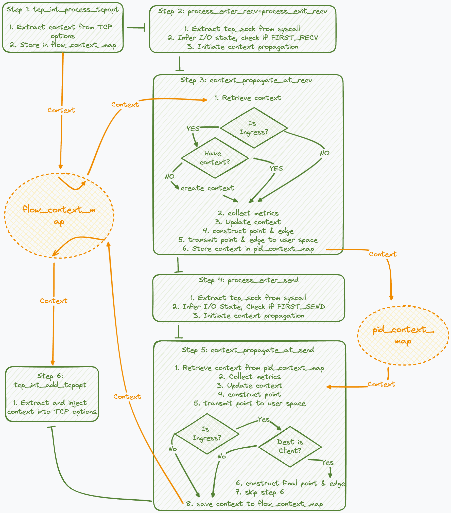

# Gearbox Context Propagation Workflow

## Overview

## Workflow

### Step 1: Parsing TCP Options

- **Function**: `tcp_int_process_tcpopt`
- **Operations**:
  1. Check and parse the TCP options in the TCP packet.
  2. Extract previously injected context information.
  3. Store the context information in the `flow_context_map` based on the flow-tuple.

### Step 2: Handling Receive System Calls

- **Functions**: `process_enter_recv` and `process_exit_recv`
- **Operations**:
  1. Extract `struct tcp_sock` from system call parameters.
  2. Determine if the previous system call was of the send type; if so, this indicates that this is the first in a sequence of receive-type system calls.
  3. If it is the FIRST_RECV, initiate context propagation.

### Step 3: Context Propagation at Receive
- **Function**: `context_propagate_at_recv`
- **Operations**:
  1. For regular components, retrieve previously saved context information from the `flow_context_map` based on the flow-tuple.
  2. Collect performance metrics.
  3. Update context information (e.g., update invoke ID), and construct `struct point` and `struct edge` based on the invoke ID, then transmit them to the user space through the ring buffer.
  4. Store the context in the `pid_context_map`.
  5. For ingress components, if there is no existing context, create a new context, and record the peer IP address as the client IP in `client_ip_map`.

### Step 4: Handling Send System Calls

- **Function**: `process_enter_send`
- **Operations**:
  1. Extract `struct tcp_sock` from system call parameters.
  2. Determine if the previous system call was of the receive type; if so, this indicates that this is the first in a sequence of send-type system calls.
  3. If it is the FIRST_SEND, initiate context propagation.

### Step 5: Context Propagation at Send

- **Function**: `context_propagate_at_send`
- **Operations**:
  1. For regular components, retrieve previously saved context information from the `pid_context_map` based on the flow-tuple.
  2. Collect performance metrics.
  3. Update context information (e.g., update invoke ID), and construct `struct point` based on the invoke ID, then transmit it to the user space through the ring buffer.
  4. Store the context in the `flow_context_map` based on the flow-tuple.
  5. For ingress components, if the destination address matches the client's flow-tuple, construct a `struct point` representing the client and the final `struct edge`, and transmit them through the ring buffer, skipping Step 6.

### Step 6: Injecting TCP Options

- **Function**: `tcp_int_add_tcpopt`
- **Operations**:
  1. Extract context based on the flow-tuple.
  2. Inject the context information into the TCP options.
